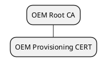
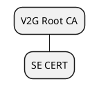
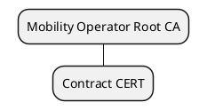

──────── *for more from the author, visit* [github.com/hazemanwer2000](https://github.com/hazemanwer2000). ────────
## *Table of Contents*

- [[#Abbreviations|Abbreviations]]
- [[#CA Hierarchies|CA Hierarchies]]
	- [[#CA Hierarchies#OEM Root CA|OEM Root CA]]
	- [[#CA Hierarchies#V2G Root CA|V2G Root CA]]
	- [[#CA Hierarchies#Mobility Operator Root CA|Mobility Operator Root CA]]
- [[#V2G Protocol|V2G Protocol]]
	- [[#V2G Protocol#Payment Options|Payment Options]]
## Content
---
### Abbreviations
---
* **SE** - Supply Equipment
* **EV** - Electric Vehicle
### CA Hierarchies
---
#### OEM Root CA
---
Every OEM maintains an **OEM Root CA**, and issues an **OEM Provisioning CERT** per EV.

The installation of an OEM Provisioning CERT into an EV usually occurs during production, and is out of scope of [1].

#### V2G Root CA
---
There is a **V2G Root CA** for every region (e.g., Europe), and it issues an **SE CERT** for every SE within its region.

To authenticate an SE, an EV needs to possess the signing V2G Root CA CERT.

#### Mobility Operator Root CA
---
Every mobility operator maintains a **Mobility Operator Root CA**, and issues a **Contract CERT** per contract with an EV.

A contract between an EV and a mobility operator enables the **Plug n' Charge (PnC)** payment method.

### V2G Protocol
---
V2G communication is based on a client-server architecture, where the EV acts as the client (requester).
#### Payment Options
---
If the **PnC** payment method is used,
* Initially, a TLS session must be established between the EV and the SE, during which the EV authenticates the SE.
* If a contract between an EV and a mobility operator has been established, but the EV has not yet received its Contract CERT,
	* During the `CertificateInstallation` exchange,
		* EV sends it OEM Provisioning CERT.
		* SE,
			* verifies the OEM Provisioning CERT,
			* checks whether a contract for the OEM Provisioning CERT is registered, and,
			* sends the Contract CERT, an ephemeral public key, and the Contract CERT private key, encrypted.
		* EV,
			* derives the encryption key using the OEM Provisioning CERT private key, and the ephemeral public key, and,
			* decrypts the private Contract CERT private key.
* During the `PaymentDetails` exchange,
	* EV sends its Contract CERT.
	* EV receives a challenge (e.g., a random number).
* During the `Authorization` exchange,
	* EV sends a signature over the previously received challenge.
	* SE verifies Contract CERT, and followingly, the signature.

If **External Payment** method is used,
* TLS session establishment is not mandatory.
* The SE does not authenticate the EV.
## References
---
[1] ISO 15118:2014, Road Vehicles, Vehicle-to-Grid (V2G) Communication Interface